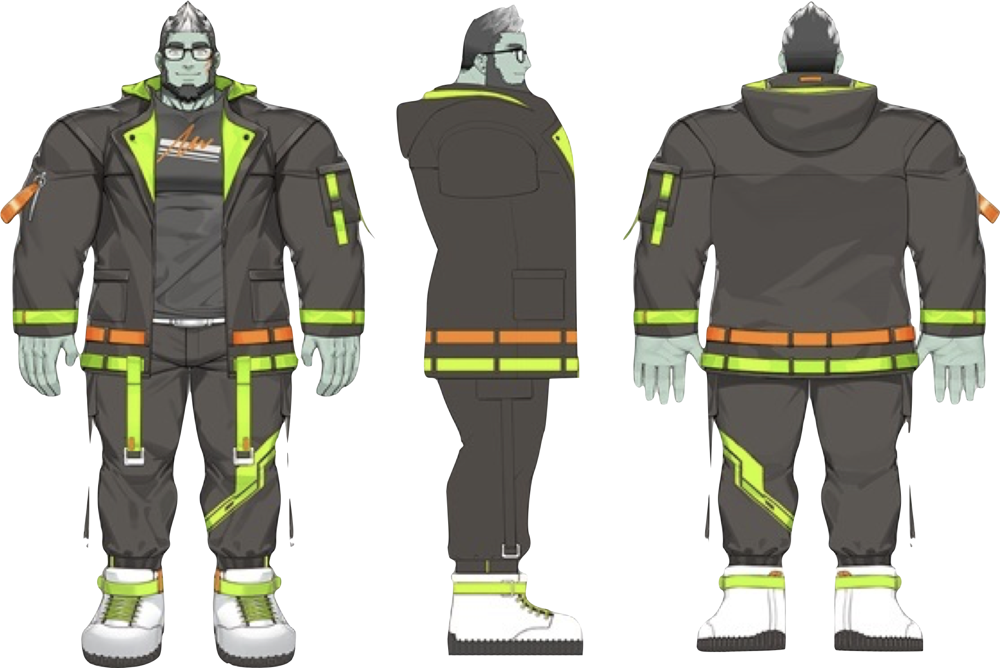
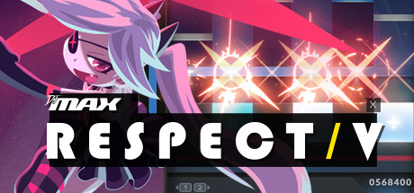
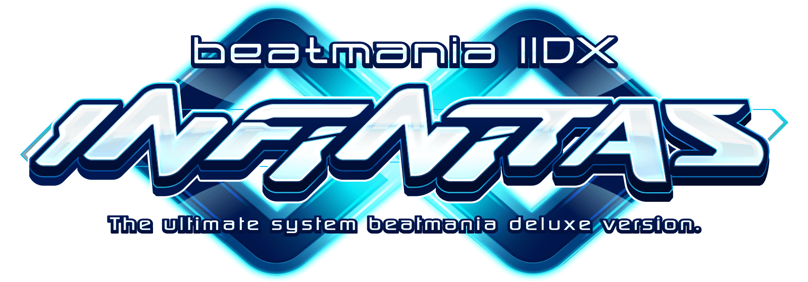
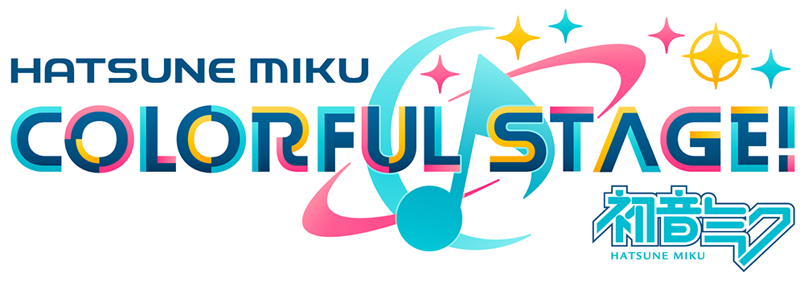
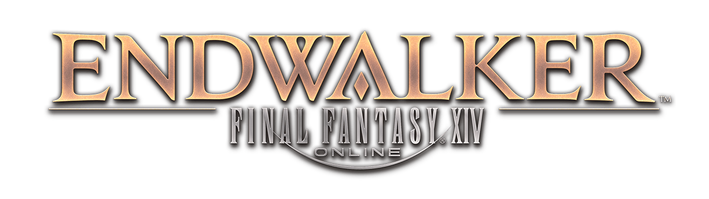
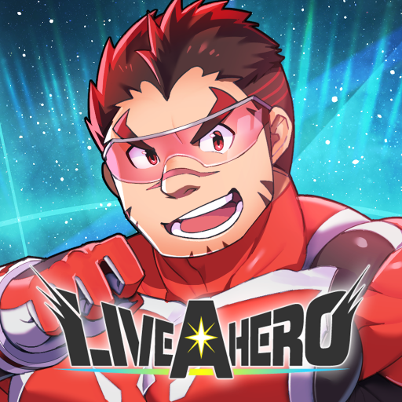
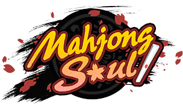
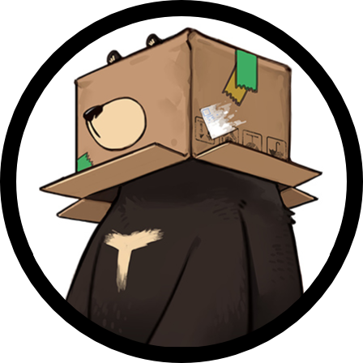
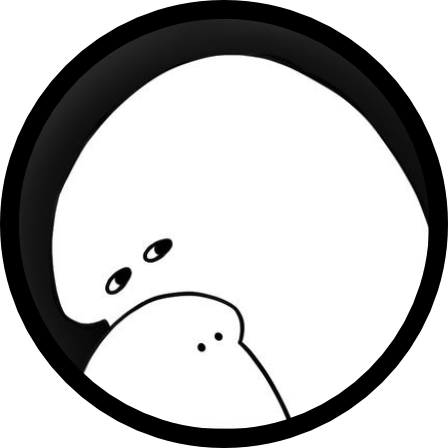

       <svg class="profile-picture-background" height="260px" width="260px">
              <circle cx="130" cy="130" r="120" stroke="#B6EF13" fill="#fff" stroke-width="15px"></circle>
       </svg>
       
       <svg class="profile-picture-border" height="130px" width="60px" style="top:0px; left:200px;">
              <circle cx="-70" cy="130" r="120" stroke="#B6EF13" fill="none" stroke-width="15px"></circle>
       </svg>
       <svg class="profile-picture-border" height="130px" width="260px" style="top:130px; left:0px">
              <circle cx="130" cy="0" r="120" stroke="#B6EF13" fill="none" stroke-width="15px"></circle>
       </svg>

       <h1 style="margin-top: 1rem; margin-bottom: 0; font-weight: 900;">Zinc Oxide</h1><h6>Rhythm Game Enthusiast Multilingual VTuber</h6>
       <h2 style="margin-bottom: 0; font-weight: 700;">산화아연</h2>
       <a class="btn btn-sm btn-link btn-secondary" href="/ko/" type="button">한국어 프로필 페이지로 이동하기</a>
       <h2 style="font-weight: 700; margin-bottom: 0;">ジンク・オクサイド</h2>
       <a class="btn btn-sm btn-link btn-secondary" href="/ja/" type="button" style="margin-bottom: 1rem;">日本語のプロフィールはこちら</a>

<a class="btn btn-link btn-lg btn-block btn-youtube-red" href="https://youtube.com/ZincOxide" type="button">
       YouTube</a>
<a class="btn btn-link btn-lg btn-block btn-twitch-purple" href="https://twitch.tv/v_zincoxide" type="button">
       Twitch</a>
<a class="btn btn-link btn-lg btn-block btn-twitter-blue" href="https://twitter.com/V_ZincOxide" type="button">
       Twitter</a>
<a class="btn btn-link btn-lg btn-block btn-marshmallow-pink" href="https://marshmallow-qa.com/v_zincoxide" type="button">
       Anonymous Questions(Marshmallow)</a>

# Profile

> A tall man with greenish skin, who’s in his late twenties.
> He had no idea what happened to him when he landed in this world alone.
> But he definitely knows that he loves this world and wants to leave the office as soon as possible.
> …Looks like even he himself has forgotten to return to his original world.
* Height: 231cm(7'7")
* Weight: 191kg(421lbs)
* Birthday: Sep 8th

# Likes
* Listening to music, Perfume
* Sub*ay Sandwiches
* Electronics(Computers, Mobile, Home appliances etc.)전자기기
* Shopping (Like character goods)
* Staying indoors
* Cats!!!!!! (but have allergy)
* those who is tall and has muscular body!(like me)
* Talking about things I like

# Games I like

       

              

                     
              

              

                     
              

              

                     
              

              

                     
              

       

       

              

                     
              

              

                     
              

              

                     
              

              

                     
              

       

       

              <h3>games I sometimes do</h3>
              <ul>
                     <li>Pop'n music</li>
                     <li>SOUND VOLTEX</li>
                     <li>Jubeat</li>
                     <li>Reflec Beat</li>
                     <li>DanceDanceRevolution</li>
                     <li>Pump it Up</li>
                     <li>EZ2AC(EZ2DJ)</li>
                     <li>Maimai</li>
                     <li>Chunithm</li>
                     <li>A Dance Of Fire And Ice</li>
                     <li>Rhythm Doctor</li>
                     <li>Tokyo Afterschool Summoners</li>
                     <li>Granblue Fantasy</li>
                     <li>Splatoon3</li>
                     <li>THEATRHYTHM FINAL BAR LINE</li>
              </ul>
       

       

              <h3>Games I have played at least once</h3>
              <ul>
                     <li>Nostalgia</li>
                     <li>GITADORA</li>
                     <li>Phigros</li>
                     <li>Deemo</li>
                     <li>Tone Sphere</li>
                     <li>Groove Coaster</li>
                     <li>Sixstar Gate: Startrail</li>
                     <li>Stray</li>
                     <li>Monster Hunter: World</li>
                     <li>Animal Crossing: New Horizons</li>
                     <li>Braid</li>
                     <li>Super Hexagon</li>
              </ul>
       

# Reason why I debuted
* To challenge to new things and activities
* To talk with others about favorite things in common
* To make friends beyond borders

# Daddy

       

              <h2 id="illustrator">Illustrator</h2>
              

                     
                     <h4 style="margin-top: 0.5rem;">GomTang</h4>
                     <a class="btn btn-link btn-twitter-blue" href="https://twitter.com/GomTang_P" type="button" style="width:120px;">
                     Twitter</a>
              

       

       

              <h2 id="rigger">Live2D Rigger</h2>
              

                     
                     <h4 style="margin-top: 0.5rem;">2395</h4>
                     <a class="btn btn-link btn-twitter-blue" href="https://twitter.com/adpn2395" type="button" style="width:120px;">
                     Twitter</a>
              

       

 
## Supporters

       

              

              <h6>Scorge</h6>
              <h6>Starflo</h6>
              <h6>코카스</h6>
              <h6>타르토</h6>
              <h6>dlunch</h6>
              

       

       

              

              <h6>김토끼</h6>
              <h6>HippoFatale</h6>
              <h6>Skyrhim</h6>
              <h6>나토나토</h6>
              <h6>Firefox</h6>
              

       

<a class="twitter-timeline" data-height="500" data-dnt="true" href="https://twitter.com/V_ZincOxide?ref_src=twsrc%5Etfw">Tweets by V_ZincOxide</a> 
