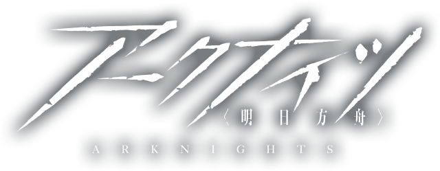
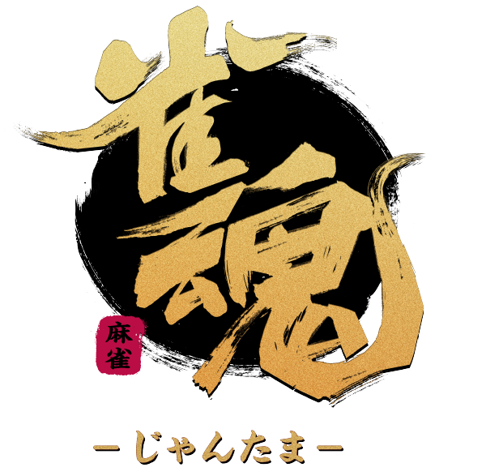

       <svg class="profile-picture-background" height="260px" width="260px">
              <circle cx="130" cy="130" r="120" stroke="#B6EF13" fill="#fff" stroke-width="15px"></circle>
       </svg>
       
       <svg class="profile-picture-border" height="130px" width="60px" style="top:0px; left:200px;">
              <circle cx="-70" cy="130" r="120" stroke="#B6EF13" fill="none" stroke-width="15px"></circle>
       </svg>
       <svg class="profile-picture-border" height="130px" width="260px" style="top:130px; left:0px">
              <circle cx="130" cy="0" r="120" stroke="#B6EF13" fill="none" stroke-width="15px"></circle>
       </svg>

       <h1 style="margin-top: 1rem; font-weight: 900; margin-bottom: 0;">ジンク・オクサイド</h1><h6>マルチリンガル音ゲー実況VTuber</h6>
       <h2 style="margin-bottom: 0; font-weight: 700;">산화아연</h2>
       <a class="btn btn-sm btn-link btn-secondary" href="/ko/" type="button">한국어 프로필 페이지로 이동하기</a>
       <h2 style="font-weight: 700; margin-bottom: 0;">Zinc Oxide</h2>
       <a class="btn btn-sm btn-link btn-secondary" href="/en/" type="button" style="margin-bottom: 1rem;">See this page in English</a>

<a class="btn btn-link btn-lg btn-block btn-youtube-red" href="https://youtube.com/ZincOxide" type="button">
       YouTube チャンネル</a>
<a class="btn btn-link btn-lg btn-block btn-twitch-purple" href="https://twitch.tv/v_zincoxide" type="button">
       Twitch</a>
<a class="btn btn-link btn-lg btn-block btn-twitter-blue" href="https://twitter.com/V_ZincOxide" type="button">
       Twitter</a>
<a class="btn btn-link btn-lg btn-block btn-marshmallow-pink" href="https://marshmallow-qa.com/v_zincoxide" type="button">
       マシュマロ</a>

# プロフィール

> 緑の肌と高い身長が特徴的な２０代後半の青年。
> 別の世界から訳もわからずにこの世界に一人で不時着してしまった。
> 現代文物に完全に夢中になった彼は、元の世界への復帰すら忘れたまま、オフィスで退勤だけを待つ。
* 名前: ジンク・オクサイド（ジンクで🆗）
* 身長: 231cm
* 体重: 191kg
* 誕生日: 9月8日

# 好きなもの
* 音楽鑑賞, パフューム
* サブ○ェイサンドイッチ
* 電子機器（パソコン、スマホ、家電などなど）
* ショッピング（おかげでグッズいっぱい買っちゃいました）
* とにかく屋内にいること
* 猫！！！！（だけど猫の毛にアレルギーがある）
* 僕みたいな筋肉が分厚く背高いキャラ
* 好きなものについて語り合うこと

# 大好きなゲーム

       

              

                     
              

              

                     
              

              

                     
              

              

                     
              

       

       

              

                     
              

              

                     
              

              

                     
              

              

                     
              

       

       

              <h3>たまにやってるゲーム</h3>
              <ul>
                     <li>ポップンミュージック</li>
                     <li>SOUND VOLTEX</li>
                     <li>Jubeat</li>
                     <li>リフレクビート</li>
                     <li>ダンスダンスレボリューション</li>
                     <li>Pumpt it Up</li>
                     <li>マイマイ</li>
                     <li>チュウニズム</li>
                     <li>A Dance Of Fire And Ice</li>
                     <li>Rhythm Doctor</li>
                     <li>東京放課後サモナーズ</li>
                     <li>グランブル・ファンタジー</li>
                     <li>スプラトゥーン3</li>
                     <li>シアトリズム　ファイナルバーライン</li>
              </ul>
       

       

              <h3>やったことはあるゲーム</h3>
              <ul>
                     <li>ノスタルジア</li>
                     <li>GITADORA</li>
                     <li>Phigros</li>
                     <li>Deemo</li>
                     <li>Tone Sphere</li>
                     <li>Groove Coaster</li>
                     <li>シックスターゲート・スタートレイル</li>
                     <li>Stray</li>
                     <li>モンスターハンター：ワールド</li>
                     <li>あつまれどうぶつの森</li>
                     <li>Braid</li>
                     <li>Super Hexagon</li>
              </ul>
       

# 活動する理由
* 新しいことに挑戦したい
* 同じ趣味、好みを持つ人たちと楽しく語り合いたい
* 国境を超えた友達を作りたい

# パパ

       

              <h2 id="illustrator">イラスト</h2>
              

                     
                     <h4 style="margin-top: 0.5rem;">GomTang</h4>
                     <a class="btn btn-link btn-twitter-blue" href="https://twitter.com/GomTang_P" type="button" style="width:120px;">
                     Twitter</a>
              

       

       

              <h2 id="rigger">Live2D</h2>
              

                     
                     <h4 style="margin-top: 0.5rem;">2395</h4>
                     <a class="btn btn-link btn-twitter-blue" href="https://twitter.com/adpn2395" type="button" style="width:120px;">
                     Twitter</a>
              

       

 
## サポーターズ

       

              

              <h6>Scorge</h6>
              <h6>Starflo</h6>
              <h6>코카스</h6>
              <h6>타르토</h6>
              <h6>dlunch</h6>
              

       

       

              

              <h6>김토끼</h6>
              <h6>HippoFatale</h6>
              <h6>Skyrhim</h6>
              <h6>나토나토</h6>
              <h6>Firefox</h6>
              

       

<a class="twitter-timeline" data-height="500" data-dnt="true" href="https://twitter.com/V_ZincOxide?ref_src=twsrc%5Etfw">Tweets by V_ZincOxide</a> 
