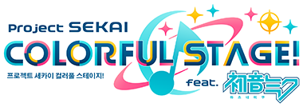
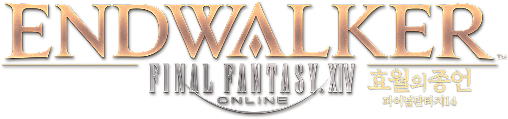

       <svg class="profile-picture-background" height="260px" width="260px">
              <circle cx="130" cy="130" r="120" stroke="#B6EF13" fill="#fff" stroke-width="15px"></circle>
       </svg>
       
       <svg class="profile-picture-border" height="130px" width="60px" style="top:0px; left:200px;">
              <circle cx="-70" cy="130" r="120" stroke="#B6EF13" fill="none" stroke-width="15px"></circle>
       </svg>
       <svg class="profile-picture-border" height="130px" width="260px" style="top:130px; left:0px">
              <circle cx="130" cy="0" r="120" stroke="#B6EF13" fill="none" stroke-width="15px"></circle>
       </svg>

       <h1 style="margin-top: 1rem; margin-bottom: 0; font-weight: 900;">산화아연</h1><h6>리듬게임을 좋아하는 아마추어 통번역가 버튜버</h6>
       <h2 style="font-weight: 700; margin-bottom: 0;">ジンク・オクサイド</h2>
       <a class="btn btn-sm btn-link btn-secondary" href="/ja/" type="button">日本語のプロフィールはこちら</a>
       <h2 style="font-weight: 700; margin-bottom: 0;">Zinc Oxide</h2>
       <a class="btn btn-sm btn-link btn-secondary" href="/en/" type="button" style="margin-bottom: 1rem;">See this page in English</a>

<a class="btn btn-link btn-lg btn-block btn-youtube-red" href="https://youtube.com/ZincOxide" type="button">
       유튜브 채널</a>
<a class="btn btn-link btn-lg btn-block btn-black" href="https://twitter.com/V_ZincOxide" type="button">
       X(트위터)</a>
<a class="btn btn-link btn-lg btn-block btn-marshmallow-pink" href="https://marshmallow-qa.com/v_zincoxide" type="button">
       마쉬멜로(익명 메시지 보내기)</a>
<a class="btn btn-link btn-lg btn-block btn-twitter-blue" href="mailto:iam@zincoxide.kr" type="button">
       이메일</a>

# 프로필

* 키: 231cm
* 몸무게: 191kg
* 생일: 9월 8일
* 데뷔일: 2022년 7월 11일

# 외국어 활동

       

              <h2>일반 활동</h2>
              <ul>
                     <li> [日] 일본어 방송활동 재생목록 <a href="https://www.youtube.com/playlist?list=PLhdOm5RxwrsZQnes7QZBb-eGVuFkqBppA">↗️</a></li>
                     <li> [한日En] YOASOBI - 축복 한영일 메들리 커버 <a href="https://youtu.be/byIku6z6sOQ?si=HcY49fpXIaOs2M9W">↗️</a></li>
              </ul>
       

       

              <h2>통번역</h2>
              <ul>
                     <li>[日→한] 花鎧照虎 - If you want to live 가사 번역 <a href="https://twitter.com/Kagai_Terutora/status/1633095988230463488">↗️</a></li>
                     <li>[日→한] BPL S2 IIDX 비공식 통역방송 <a href="https://youtube.com/playlist?list=PLhdOm5RxwrsYrcQxI11Q9bEzZzi8BY7ME&si=m0Q-DGr9Be4JLDXD">↗️</a></li>
                     <li>[한↔日] 2언어 라디오 "1인2역" <a href="https://youtube.com/playlist?list=PLhdOm5RxwrsbeACu-f9dX91us7uSajouf&si=DDL8Ggyf1R5wuIpi">↗️</a></li>
                     <li>[한→日] ???  </li>
              </ul>
       

# 주력 게임

       

              

                     
              

              

                     
              

              

                     
              

              

                     
              

       

       

              

                     
              

              

                     
              

              

                     
              

       

       

              <h3>가끔씩 하는 게임</h3>
              <ul>
                     <li>팝픈뮤직</li>
                     <li>사운드 볼텍스</li>
                     <li>유비트</li>
                     <li>리플렉 비트</li>
                     <li>댄스 댄스 레볼루션</li>
                     <li>펌프 잇 업</li>
                     <li>EZ2AC(EZ2DJ)</li>
                     <li>마이마이</li>
                     <li>츄니즘</li>
                     <li>A Dance Of Fire And Ice</li>
                     <li>Rhythm Doctor</li>
                     <li>도쿄 방과후 서모너즈</li>
                     <li>그랑블루 판타지</li>
                     <li>스플래툰3</li>
                     <li>시아트리듬 파이널 바 라인</li>
                     <li>명일방주</li>
              </ul>
       

       

              <h3>해본 적은 있는 게임</h3>
              <ul>
                     <li>노스탤지어</li>
                     <li>기타도라</li>
                     <li>Phigros</li>
                     <li>Deemo</li>
                     <li>Tone Sphere</li>
                     <li>Groove Coaster(Rhythmvaders)</li>
                     <li>식스타 게이트: 스타 트레일</li>
                     <li>Stray</li>
                     <li>몬스터 헌터:월드</li>
                     <li>모여봐요 동물의 숲</li>
                     <li>Braid</li>
                     <li>Super Hexagon</li>
              </ul>
       

# 버추얼 부모님

       

              <h2 id="illustrator">일러스트</h2>
              

                     
                     <h4 style="margin-top: 0.5rem;">곰탕(GomTang)</h4>
                     <a class="btn btn-link btn-twitter-blue" href="https://twitter.com/GomTang_P" type="button" style="width:120px;">
                     Twitter</a>
              

       

       

              <h2 id="rigger">Live2D</h2>
              

                     
                     <h4 style="margin-top: 0.5rem;">이삼구오(2395)</h4>
                     <a class="btn btn-link btn-twitter-blue" href="https://twitter.com/adpn2395" type="button" style="width:120px;">
                     Twitter</a>
              

       

 
## 용기를 주신 분들

       

              

              <h6>Scorge</h6>
              <h6>Starflo</h6>
              <h6>코카스</h6>
              <h6>타르토</h6>
              <h6>dlunch</h6>
              

       

       

              

              <h6>김토끼</h6>
              <h6>HippoFatale</h6>
              <h6>Skyrhim</h6>
              <h6>나토나토</h6>
              <h6>Firefox</h6>
              

       

